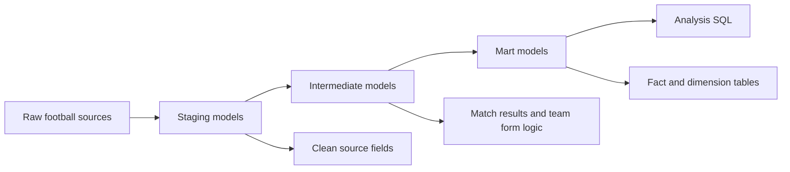

# Football Analytics

A dbt-powered football analytics project that transforms raw match, team, player, and league data into tested marts for sports analysis.

## Problem

Football data is naturally spread across match records, teams, players, leagues, countries, and time-based player attributes. Useful analysis requires repeatable cleaning, consistent identifiers, and reusable metrics for match outcomes, team performance, player profiles, and league summaries.

This project turns raw football data into an analytics-ready dbt model layer.

## Dataset / Source

The repository models football data represented by dbt sources for:

| Source area | Purpose |
|---|---|
| Matches | Match results, teams, dates, goals, and outcomes |
| Teams | Team identifiers and names |
| Team attributes | Time-varying team attributes |
| Players | Player identifiers and profile fields |
| Player attributes | Time-varying player ratings and skills |
| Leagues / countries | Competition and country context |
| `league_tiers.csv` seed | Static league tier mapping |

## Tech Stack

- **Transformation:** dbt Core
- **Language:** SQL
- **Modeling pattern:** Staging -> Intermediate -> Marts
- **Testing:** dbt schema tests
- **Version control:** Git / GitHub

## Architecture / Workflow



## Data Model

| Model | Grain | Purpose |
|---|---|---|
| `fct_matches` | One row per match | Match result and score analysis |
| `fct_player_stats` | One row per player per year | Averaged player attributes over time |
| `dim_players` | One row per player | Player profile fields and latest attributes |
| `dim_teams` | One row per team | Aggregate team performance metrics |
| `dim_leagues` | One row per league | League, country, tier, and match summary fields |

Intermediate models include:

- `int_match_results`: standardizes match outcome logic.
- `int_team_form`: calculates recent team form.

Macros include:

- `calculate_points.sql`: points logic for match outcomes.
- `flip_result.sql`: reusable result transformation logic.

## Results / Hiring Evidence

- Built a layered dbt project for sports analytics.
- Created final fact and dimension models for matches, players, teams, and leagues.
- Added dbt tests for key mart fields such as `match_id`, `team_id`, `player_id`, and `league_id`.
- Added reusable macros for football-specific result and points logic.
- Included analysis queries for league standings, home vs away performance, player rating vs potential, and recent team form.

## Analysis Questions Supported

- Which teams have the strongest home vs away performance?
- How does recent team form change across matches?
- Which players show the strongest relationship between rating and potential?
- How do leagues compare by tier and match volume?
- Which teams are strongest by wins, losses, draws, and points?

## How to Run

1. Clone the repository.

```bash
git clone https://github.com/LukeOpany/football-analytics.git
cd football-analytics
```

2. Create and activate a virtual environment.

```bash
python -m venv venv
source venv/bin/activate
```

3. Install dbt and your database adapter.

```bash
pip install dbt-core
pip install dbt-postgres
```

4. Configure your dbt profile for the target database.

```bash
dbt debug
dbt run
dbt test
```

5. Generate docs when needed.

```bash
dbt docs generate
dbt docs serve
```

## What I Learned / Production Improvements

This project demonstrates:

- How to use dbt to organize sports analytics logic.
- How to separate raw cleanup from reusable intermediate transformations.
- How to create fact and dimension models with clear grains.
- How to encode domain rules, such as match points and result flipping, in reusable SQL macros.

Production next steps:

- Add source freshness checks.
- Add more relationship tests across match, team, player, and league IDs.
- Publish dbt docs for lineage review.
- Add dashboard-ready marts for standings, player comparison, and team form.
- Add CI to run `dbt build` on pull requests.
