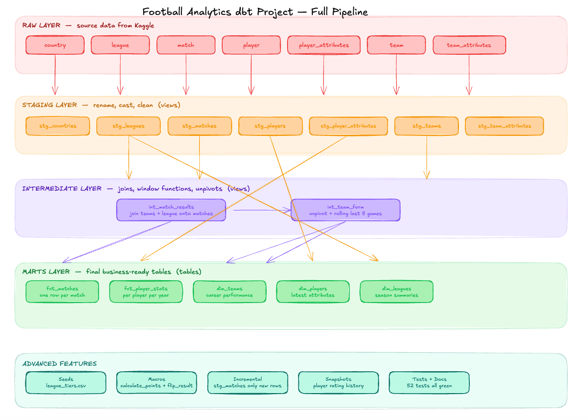

# Football Analytics

A dbt-powered football analytics project that transforms raw football data into clean, tested, analysis-ready models for team, player, and match performance insights.

---

## Overview

This project uses **dbt Core** to build a structured analytics pipeline for football data.

The goal is to transform raw football datasets into reliable analytical models that can support questions around:

- Team performance
- Player performance
- Match outcomes
- Goals, assists, and attacking output
- Defensive performance
- League and competition trends

The project follows a layered dbt architecture:

- **Staging**: clean and standardize raw source data
- **Intermediate**: combine models and apply reusable business logic
- **Marts**: create final analysis-ready tables

---

## Purpose

This project was built to demonstrate how modern analytics engineering workflows can be applied to football data.

It combines:

- Football analytics
- SQL-based data transformation
- dbt modeling best practices
- Analytics engineering workflows
- Data quality testing
- Modular pipeline architecture

The repository is designed as a portfolio-ready analytics engineering project that showcases practical data transformation and sports analytics skills.

---

## Tech Stack

- **Transformation**: dbt Core
- **Language**: SQL
- **Data Modeling**: dbt models
- **Version Control**: Git / GitHub
- **Analytics Workflow**: Staging → Intermediate → Marts

---

## Project Structure

```text
football-analytics/
├── analyses/            # Ad hoc analytical SQL queries
├── macros/              # Reusable dbt macros
├── models/              # dbt models
│   ├── staging/         # Cleaned source-level models
│   ├── intermediate/    # Joined and transformed models
│   └── marts/           # Final analytics-ready tables
├── seeds/               # Static CSV files loaded by dbt
├── snapshots/           # Snapshot models for tracking changes over time
├── tests/               # Custom dbt tests
├── dbt_project.yml      # dbt project configuration
└── README.md
```

---

## Pipeline Layers

### Staging

The staging layer prepares raw football data for analysis.

Responsibilities:

- Rename columns into a consistent format
- Cast columns into the correct data types
- Remove unnecessary fields
- Standardize team, player, and match identifiers
- Keep transformations simple and source-aligned

---

### Intermediate

The intermediate layer applies reusable football analytics logic.

Responsibilities:

- Join match, team, and player data
- Create calculated performance metrics
- Aggregate event-level or match-level data
- Prepare reusable models for final marts

Example logic may include:

- Goals per team
- Player contributions
- Match-level summaries
- Team attacking and defensive metrics

---

### Marts

The marts layer contains final business-facing analytics models.

These models are designed for reporting, dashboards, and deeper football analysis.

| Model | Description |
|---|---|
| `fct_matches` | One row per match with key match metrics |
| `fct_player_performance` | Player-level performance metrics |
| `fct_team_performance` | Team-level match and season performance |
| `dim_players` | Player profile and reference data |
| `dim_teams` | Team profile and reference data |

---

## Analytics Use Cases

This project can support analysis such as:

- Which teams are most efficient in attack?
- Which players contribute most to goals and assists?
- How do teams perform across different competitions?
- Which teams are strongest defensively?
- How does match performance change over time?
- What patterns exist across wins, losses, and draws?

---

## Data Modeling Approach

The project follows analytics engineering best practices:

- Modular SQL models
- Clear model naming conventions
- Separation of raw, intermediate, and final models
- Reusable transformation logic
- dbt testing for data quality
- Documentation-ready model structure

---

## Getting Started

### Prerequisites

Make sure you have:

- Python 3.11+
- dbt Core
- A supported database adapter
- Git

---

### Installation

Clone the repository:

```bash
git clone https://github.com/LukeOpany/football-analytics.git
cd football-analytics
```

Create and activate a virtual environment:

```bash
python -m venv venv
source venv/bin/activate
```

Install dbt:

```bash
pip install dbt-core
```

If you are using PostgreSQL, install the PostgreSQL adapter:

```bash
pip install dbt-postgres
```

---

## Running the Project

Check your dbt connection:

```bash
dbt debug
```

Run all models:

```bash
dbt run
```

Run tests:

```bash
dbt test
```

Generate dbt documentation:

```bash
dbt docs generate
dbt docs serve
```

---

## Testing

The project can use dbt tests to validate data quality.

Common tests include:

- `unique` — ensures primary keys are not duplicated
- `not_null` — ensures required fields are populated
- `accepted_values` — ensures categorical fields contain valid values
- `relationships` — ensures foreign keys match related tables

Example:

```bash
dbt test
```

---

## Future Improvements

Planned improvements include:

- Add more advanced football metrics
- Build player comparison models
- Create team performance dashboards
- Add expected goals analysis
- Add season-over-season trend models
- Improve dbt documentation and model descriptions
- Add more tests for data quality